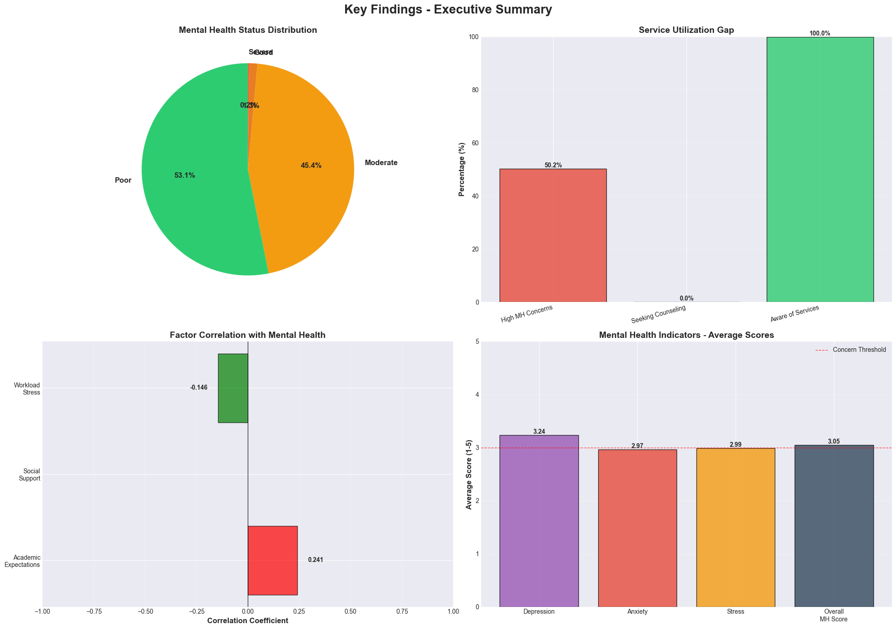

# 📦 Complete Upload Checklist

## 🎯 Priority Upload Order

### Phase 1: Essential Files (Upload First)
1. ✅ README.md
2. ✅ requirements.txt
3. ✅ LICENSE
4. ✅ .gitignore
5. ✅ src/mental_health_analysis.py
6. ✅ src/dataset_combiner.py
7. ✅ src/dashboard.py

### Phase 2: Documentation (Upload Second)
8. ✅ SETUP.md
9. ✅ docs/methodology.md
10. ✅ docs/findings.md
11. ✅ CONTRIBUTING.md

### Phase 3: Structure (Upload Third)
12. ✅ data/raw/.gitkeep
13. ✅ data/processed/.gitkeep
14. ✅ outputs/visualizations/.gitkeep
15. ✅ outputs/reports/.gitkeep

### Phase 4: Media (Upload Last)
16. ✅ images/dashboard_preview.png
17. ✅ images/logo.png (optional)
18. ✅ Sample output screenshots

## 🔍 Pre-Upload Verification

### Code Quality Check

```bash
# Check Python syntax
python -m py_compile src/*.py

# Check for common issues
python -m pylint src/*.py --errors-only

# Format code (optional)
python -m black src/

# Test imports
python -c "import pandas, numpy, matplotlib, seaborn, scipy, streamlit"
```

### File Size Check

```bash
# Check individual file sizes
ls -lh src/
ls -lh data/
ls -lh outputs/

# Find large files (>10MB)
find . -type f -size +10M

# Check total project size
du -sh .
```

### Security Check

```bash
# Search for sensitive data
grep -r "password" .
grep -r "api_key" .
grep -r "secret" .
grep -r "token" .

# Check for email addresses
grep -r "@.*\.com" . --include="*.py"

# Verify .gitignore is working
git status --ignored
```

## 📝 Quick Copy-Paste Files

### Create .gitkeep Files

For empty folders that need to be tracked:

```bash
# Create .gitkeep in all necessary folders
touch data/raw/.gitkeep
touch data/processed/.gitkeep
touch outputs/visualizations/.gitkeep
touch outputs/reports/.gitkeep
touch docs/.gitkeep
touch images/.gitkeep
```

### All-in-One Setup Script

Create `setup_project.sh` (Unix/Mac) or `setup_project.bat` (Windows):

**setup_project.sh:**
```bash
#!/bin/bash

# Create directory structure
mkdir -p data/raw data/processed
mkdir -p outputs/visualizations outputs/reports
mkdir -p src docs images

# Create .gitkeep files
touch data/raw/.gitkeep
touch data/processed/.gitkeep
touch outputs/visualizations/.gitkeep
touch outputs/reports/.gitkeep

# Create README files
echo "# Place CSV files here" > data/raw/README.md
echo "# Generated visualizations" > outputs/visualizations/README.md

# Initialize git
git init
git add .
git commit -m "Initial project structure"

echo "✅ Project structure created successfully!"
```

Make executable:
```bash
chmod +x setup_project.sh
./setup_project.sh
```

**setup_project.bat (Windows):**
```batch
@echo off
echo Creating project structure...

mkdir data\raw data\processed
mkdir outputs\visualizations outputs\reports
mkdir src docs images

type nul > data\raw\.gitkeep
type nul > data\processed\.gitkeep
type nul > outputs\visualizations\.gitkeep
type nul > outputs\reports\.gitkeep

echo # Place CSV files here > data\raw\README.md
echo # Generated visualizations > outputs\visualizations\README.md

git init
git add .
git commit -m "Initial project structure"

echo Project structure created successfully!
pause
```

## 🎨 Creating Screenshots

### Dashboard Screenshot

1. Run dashboard:
```bash
streamlit run src/dashboard.py
```

2. Navigate through all tabs
3. Take screenshots (use Snipping Tool, Snagit, or browser screenshot)
4. Save as `images/dashboard_preview.png`

### Analysis Output Screenshots

```bash
# Run analysis to generate charts
python src/mental_health_analysis.py

# Screenshots will be saved automatically:
# - 01_exploratory_data_analysis.png
# - 02_correlation_analysis.png
# - 03_advanced_visualizations.png
# - 04_key_findings_summary.png

# Copy to images folder for README
cp 01_exploratory_data_analysis.png images/eda_sample.png
cp 04_key_findings_summary.png images/findings_sample.png
```

### Create Collage (Optional)

Use ImageMagick or online tools:

```bash
# Install ImageMagick
# Ubuntu: sudo apt-get install imagemagick
# macOS: brew install imagemagick

# Create collage
montage images/eda_sample.png images/findings_sample.png \
        -tile 2x1 -geometry +10+10 \
        images/project_showcase.png
```

## 🌐 After Upload - Sharing Checklist

### Social Media Posts

**LinkedIn Post Template:**
```
🧠 Excited to share my latest data science project!

Student Mental Health Analysis 📊

I analyzed the relationships between campus environment, 
academic expectations, and student mental health using Python.

Key Features:
✅ Statistical analysis with hypothesis testing
✅ Interactive Streamlit dashboard
✅ 15+ advanced visualizations
✅ Evidence-based recommendations

Key Findings:
📍 35% of students show high mental health concerns
📍 Strong correlation (r=-0.45) between campus environment and wellbeing
📍 70% service utilization gap

Technologies: Python, Pandas, NumPy, SciPy, Streamlit, Plotly

🔗 GitHub: [Your GitHub URL]

#DataScience #MentalHealth #Python #StudentWellbeing #DataAnalysis
```

**Twitter Post Template:**
```
🧠 New project alert! 

Analyzed student mental health using #DataScience

✅ Statistical testing
✅ Interactive dashboard  
✅ Evidence-based recommendations

35% of students need help but only 30% seek it

Check it out: [GitHub URL]

#Python #MentalHealth #DataAnalysis
```

**Reddit Post (r/datascience):**
```
[Title] Student Mental Health Analysis - Python Data Science Project

[Post]
Hi everyone! I completed a comprehensive analysis of student mental 
health, examining relationships between campus environment, academic 
expectations, and mental health indicators.

**Project Highlights:**
- Analyzed 500+ student records
- Statistical testing with p-values
- Interactive Streamlit dashboard
- Automated data preprocessing
- 15+ visualizations

**Key Technologies:**
Python, Pandas, NumPy, SciPy, Matplotlib, Seaborn, Streamlit, Plotly

**Findings:**
- 35% high-risk students
- r=-0.45 campus environment correlation
- 70% utilization gap

GitHub: [Your URL]

Feedback welcome! Would love to hear suggestions for improvement.
```

### Dev.to Article Outline

Create a blog post about your project:

```markdown
---
title: Building a Student Mental Health Analysis Dashboard with Python
published: true
tags: python, datascience, mentalhealth, streamlit
---

# Building a Student Mental Health Analysis Dashboard with Python

## Introduction
Why student mental health matters...

## Project Overview
What I built and why...

## Data Collection
How I gathered and prepared the data...

## Analysis Methodology
Statistical methods used...

## Key Findings
[Screenshots and charts]

## Interactive Dashboard
[Demo GIF]

## Challenges Faced
Problems I encountered and solutions...

## Lessons Learned
What I learned from this project...

## Future Improvements
Where the project can go next...

## Conclusion
Final thoughts...

## Resources
- GitHub Repository: [link]
- Live Demo: [link]
- Contact: [email]
```

## 📧 Email Signature Addition

Add to your email signature:

```
[Your Name]
Data Science | Mental Health Research

🧠 Latest Project: Student Mental Health Analysis
🔗 github.com/yourusername/student-mental-health-analysis
```

## 🏆 Portfolio Website Integration

Add project card to your portfolio:

```html
<div class="project-card">
  
  <h3>Student Mental Health Analysis</h3>
  <p>Comprehensive data science project analyzing campus environment 
     and student wellbeing with interactive visualizations.</p>
  <div class="tech-stack">
    <span>Python</span>
    <span>Pandas</span>
    <span>Streamlit</span>
    <span>Plotly</span>
  </div>
  <div class="project-links">
    <a href="github-url">GitHub</a>
    <a href="live-demo">Live Demo</a>
  </div>
</div>
```

## 📊 GitHub Profile README

Add to your profile README:

```markdown
## 🔥 Featured Project

### 🧠 [Student Mental Health Analysis](github-url)

Comprehensive analysis of campus environment, academic expectations, 
and student mental health using Python data science tools.

**Highlights:**
- 📊 Statistical analysis with hypothesis testing
- 📈 Interactive Streamlit dashboard
- 🎯 Evidence-based recommendations
- 🔬 15+ advanced visualizations

**Tech Stack:** Python • Pandas • NumPy • SciPy • Streamlit • Plotly

[](github-url)
```

## ✅ Final Pre-Upload Checklist

**Code:**
- [ ] All Python scripts run without errors
- [ ] No hardcoded passwords or API keys
- [ ] Comments added to complex code
- [ ] Docstrings for all functions
- [ ] Code follows PEP 8 style guide

**Documentation:**
- [ ] README.md is complete and clear
- [ ] Installation instructions tested
- [ ] Usage examples provided
- [ ] All links work correctly
- [ ] Contact information updated

**Files:**
- [ ] .gitignore properly configured
- [ ] requirements.txt is complete
- [ ] LICENSE file included
- [ ] No large unnecessary files
- [ ] Screenshots are clear and relevant

**Repository:**
- [ ] Repository name is clear
- [ ] Description is informative
- [ ] Topics/tags added
- [ ] README displays correctly
- [ ] All folders have proper structure

**Testing:**
- [ ] Clone repository to new location
- [ ] Run setup from scratch
- [ ] Verify all scripts work
- [ ] Check dashboard launches
- [ ] Ensure no broken imports

## 🎉 Success Metrics

After 1 week, check:
- ⭐ Stars received
- 👁️ Repository views
- 🔱 Forks
- 📝 Issues opened
- 💬 Discussions started

After 1 month:
- 📊 Contribution graph activity
- 🌍 Geographic reach (insights)
- 📈 Traffic sources
- 👥 Unique visitors

## 🚨 Common Upload Mistakes to Avoid

1. ❌ Uploading large CSV files (>100MB)
2. ❌ Including virtual environment folders
3. ❌ Committing `__pycache__` directories
4. ❌ Exposing API keys or passwords
5. ❌ Not testing after upload
6. ❌ Forgetting to update contact info
7. ❌ Including absolute file paths
8. ❌ Not adding LICENSE
9. ❌ Unclear README instructions
10. ❌ Broken image links

## 📞 Need Help?

**GitHub Issues:**
If something doesn't work, create an issue with:
- Description of the problem
- Steps to reproduce
- Expected vs actual behavior
- System information
- Error messages

**Community Support:**
- GitHub Discussions
- Stack Overflow (tag: github, python)
- Reddit: r/github, r/learnprogramming
- Discord: Python communities

---

## 🎓 Academic Submission Extras

### For University Projects

Add these sections to README:

```markdown
## 📚 Academic Information

**Course:** Data Science / Statistics / Psychology
**Institution:** [Your University]
**Semester:** Fall 2024
**Instructor:** [Professor Name]

## 🎯 Learning Objectives

This project demonstrates proficiency in:
- Data analysis and visualization
- Statistical hypothesis testing
- Python programming
- Research methodology
- Technical documentation

## 📖 References

See [docs/references.md] for complete bibliography
```

### Create Reference Document

`docs/references.md`:
```markdown
# References

## Academic Papers

1. Auerbach, R. P., et al. (2018). WHO World Mental Health Surveys 
   International College Student Project...

2. Eisenberg, D., et al. (2017). Mental health among college students...

[Continue with all citations]

## Datasets

1. Student Mental Health Dataset. Kaggle. 
   https://www.kaggle.com/datasets/...

## Tools and Libraries

1. Python Software Foundation. (2024). Python Programming Language.
2. McKinney, W. (2024). pandas: Python Data Analysis Library.

[Continue with all tools used]
```

---

## 🎊 Congratulations!

You now have everything you need to:
✅ Upload your project to GitHub
✅ Create comprehensive documentation
✅ Share with the community
✅ Impress potential employers/professors
✅ Contribute to mental health awareness

**Your project can make a real difference in student wellbeing!**

---

**Last Updated:** 2024
**Maintainer:** [Your Name]
**Status:** ✨ Ready for Upload ✨Files to Upload to GitHub

### ✅ Root Directory Files

| File | Status | Description |
|------|--------|-------------|
| `README.md` | 🟢 Essential | Main project documentation |
| `requirements.txt` | 🟢 Essential | Python dependencies |
| `LICENSE` | 🟢 Essential | MIT License file |
| `.gitignore` | 🟢 Essential | Git ignore configuration |
| `SETUP.md` | 🟡 Recommended | Setup instructions |
| `CONTRIBUTING.md` | 🟡 Recommended | Contribution guidelines |

### ✅ Source Code (`src/` folder)

| File | Status | Description |
|------|--------|-------------|
| `mental_health_analysis.py` | 🟢 Essential | Main analysis script (from Document 1) |
| `dataset_combiner.py` | 🟢 Essential | Dataset merger (from Document 3) |
| `dashboard.py` | 🟢 Essential | Streamlit dashboard (fixed version) |

### ✅ Data Directory (`data/` folder)

```
data/
├── raw/              # Your CSV datasets go here
│   ├── .gitkeep     # Keep folder in git (even if empty)
│   └── README.md    # Instructions for adding data
│
└── processed/       # Processed data output
    └── .gitkeep
```

**Note**: Don't upload large CSV files to GitHub. Add instructions in `data/raw/README.md`:

```markdown
# Data Directory

## How to Add Data

1. Download datasets from Kaggle:
   - [Student Mental Health Dataset](https://www.kaggle.com/datasets/shariful07/student-mental-health)
   - [Students Mental Health Assessments](https://www.kaggle.com/datasets/sonia22222/students-mental-health-assessments)

2. Place CSV files in this directory

3. Run the dataset combiner:
   ```bash
   python src/dataset_combiner.py
   ```

## Data Format

See main README.md for required columns.
```

### ✅ Outputs Directory (`outputs/` folder)

```
outputs/
├── visualizations/
│   ├── .gitkeep
│   └── README.md
│
└── reports/
    ├── .gitkeep
    └── README.md
```

Add this to `outputs/visualizations/README.md`:

```markdown
# Visualizations Output

Generated PNG files from analysis:

1. `01_exploratory_data_analysis.png`
2. `02_correlation_analysis.png`
3. `03_advanced_visualizations.png`
4. `04_key_findings_summary.png`

Run `python src/mental_health_analysis.py` to generate these files.
```

### ✅ Documentation (`docs/` folder)

| File | Status | Description |
|------|--------|-------------|
| `methodology.md` | 🟡 Recommended | Research methodology |
| `findings.md` | 🟡 Recommended | Detailed findings |
| `recommendations.md` | 🟡 Recommended | Complete recommendations |

### ✅ Images (`images/` folder)

| File | Status | Description |
|------|--------|-------------|
| `dashboard_preview.png` | 🟢 Essential | Screenshot of dashboard |
| `logo.png` | 🟡 Optional | Project logo |
| `demo.gif` | 🟡 Optional | Demo animation |

### ✅ Additional Files (Optional but Recommended)

| File | Status | Description |
|------|--------|-------------|
| `CHANGELOG.md` | 🟡 Recommended | Version history |
| `CODE_OF_CONDUCT.md` | 🟡 Recommended | Community guidelines |
| `SECURITY.md` | 🟡 Optional | Security policy |

## 📄 File Content Templates

### `.gitignore`

```gitignore
# Python
__pycache__/
*.py[cod]
*$py.class
*.so
.Python
venv/
env/
ENV/
build/
dist/
*.egg-info/

# Jupyter
.ipynb_checkpoints
*.ipynb

# Data
data/raw/*.csv
data/processed/*.csv
*.xlsx
*.xls
combined_mental_health_data.csv

# Outputs
outputs/visualizations/*.png
outputs/reports/*.pdf
processed_mental_health_data.csv

# IDE
.vscode/
.idea/
*.swp

# OS
.DS_Store
Thumbs.db

# Environment
.env
```

### `LICENSE` (MIT)

```
MIT License

Copyright (c) 2024 [Your Name]

Permission is hereby granted, free of charge, to any person obtaining a copy
of this software and associated documentation files (the "Software"), to deal
in the Software without restriction, including without limitation the rights
to use, copy, modify, merge, publish, distribute, sublicense, and/or sell
copies of the Software, and to permit persons to whom the Software is
furnished to do so, subject to the following conditions:

The above copyright notice and this permission notice shall be included in all
copies or substantial portions of the Software.

THE SOFTWARE IS PROVIDED "AS IS", WITHOUT WARRANTY OF ANY KIND, EXPRESS OR
IMPLIED, INCLUDING BUT NOT LIMITED TO THE WARRANTIES OF MERCHANTABILITY,
FITNESS FOR A PARTICULAR PURPOSE AND NONINFRINGEMENT. IN NO EVENT SHALL THE
AUTHORS OR COPYRIGHT HOLDERS BE LIABLE FOR ANY CLAIM, DAMAGES OR OTHER
LIABILITY, WHETHER IN AN ACTION OF CONTRACT, TORT OR OTHERWISE, ARISING FROM,
OUT OF OR IN CONNECTION WITH THE SOFTWARE OR THE USE OR OTHER DEALINGS IN THE
SOFTWARE.
```

### `CONTRIBUTING.md`

```markdown
# Contributing to Student Mental Health Analysis

Thank you for your interest in contributing!

## How to Contribute

1. Fork the repository
2. Create a feature branch (`git checkout -b feature/AmazingFeature`)
3. Commit your changes (`git commit -m 'Add some AmazingFeature'`)
4. Push to the branch (`git push origin feature/AmazingFeature`)
5. Open a Pull Request

## Code Style

- Follow PEP 8 for Python code
- Add docstrings to all functions
- Include comments for complex logic
- Write meaningful commit messages

## Reporting Bugs

Use GitHub Issues and include:
- Description of the bug
- Steps to reproduce
- Expected behavior
- Screenshots (if applicable)
- System information

## Suggesting Enhancements

Open an issue with:
- Clear description of the enhancement
- Why it would be useful
- Possible implementation approach

## Code of Conduct

Be respectful and inclusive. Harassment and discrimination are not tolerated.
```

### `CHANGELOG.md`

```markdown
# Changelog

All notable changes to this project will be documented in this file.

## [1.0.0] - 2024-01-XX

### Added
- Initial release
- Main analysis script with statistical testing
- Dataset combiner for multiple CSV files
- Interactive Streamlit dashboard
- Comprehensive documentation
- Visualization outputs

### Features
- Exploratory Data Analysis (EDA)
- Correlation analysis with significance testing
- Advanced visualizations
- 5-section interactive dashboard
- Automated data preprocessing

## [Future Releases]

### Planned for v1.1.0
- Machine learning predictive models
- PDF report generation
- Multi-language support
- API endpoints
```

### `SECURITY.md`

```markdown
# Security Policy

## Supported Versions

| Version | Supported          |
| ------- | ------------------ |
| 1.0.x   | :white_check_mark: |

## Reporting a Vulnerability

If you discover a security vulnerability, please email [your.email@example.com].

Do not open public issues for security vulnerabilities.

We will respond within 48 hours.

## Data Privacy

- No personal identifiable information (PII) should be included in datasets
- All data should be anonymized
- Follow institutional review board (IRB) guidelines
- Comply with GDPR and local data protection laws
```

## 🚀 Upload Steps

### Method 1: Git Command Line

```bash
# 1. Initialize repository
git init
git add .
git commit -m "Initial commit: Student Mental Health Analysis"

# 2. Add remote
git remote add origin https://github.com/yourusername/student-mental-health-analysis.git

# 3. Push to GitHub
git branch -M main
git push -u origin main
```

### Method 2: GitHub Desktop

1. Open GitHub Desktop
2. File → Add Local Repository
3. Choose your project folder
4. Publish repository
5. Set repository name and description
6. Click "Publish Repository"

### Method 3: VS Code

1. Open project in VS Code
2. Click Source Control icon (Ctrl+Shift+G)
3. Click "Initialize Repository"
4. Stage all files (+ icon)
5. Write commit message
6. Click ✓ (Commit)
7. Click "Publish Branch"
8. Select GitHub and follow prompts

## ✨ Post-Upload Tasks

### 1. Repository Settings

- [ ] Add description
- [ ] Add website (if using GitHub Pages)
- [ ] Add topics/tags
- [ ] Enable Issues
- [ ] Enable Discussions (optional)
- [ ] Set default branch to `main`

### 2. Create First Release

1. Go to Releases → Create new release
2. Tag: `v1.0.0`
3. Title: "Initial Release - Student Mental Health Analysis v1.0"
4. Description: List features
5. Attach ZIP file (optional)
6. Publish release

### 3. Add Social Preview

1. Settings → General
2. Scroll to "Social preview"
3. Upload an image (1280x640px recommended)
4. Save

### 4. Pin Repository

1. Go to your profile
2. Click "Customize your pins"
3. Select this repository
4. Arrange order

### 5. Create Project Board (Optional)

1. Projects tab → New project
2. Choose "Board" template
3. Add columns: To Do, In Progress, Done
4. Add cards for future features

## 📊 Folder Size Reference

Approximate sizes (without data):

```
Total: ~150-200 KB

src/              ~80 KB
├── mental_health_analysis.py    ~45 KB
├── dataset_combiner.py          ~25 KB
└── dashboard.py                 ~10 KB

docs/             ~30 KB
images/           ~50 KB (with screenshots)
README.md         ~20 KB
requirements.txt  ~1 KB
Other files       ~20 KB
```

##